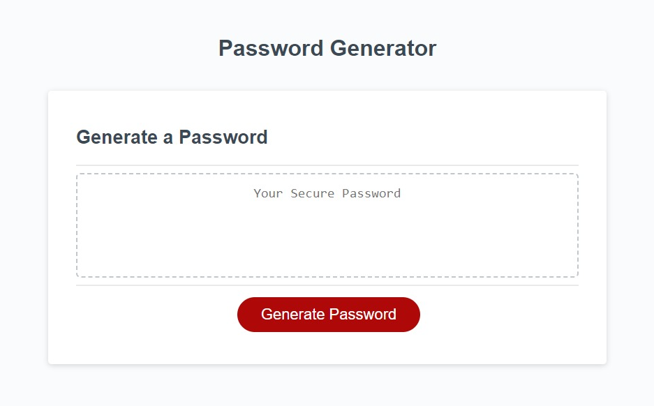

# Password Generator

## Description

This is a password generator that takes your input on its conditions.

- I needed a way to generate secure and randomized passwords to support numerous accounts that I continue to aquire.
- This eliminates the need to come up with passwords on my own and risk repeats or common phrases.
- I learned more about randomization and utilizing functions to perform individual tasks.

## Installation

N/A

## Usage

To use this application, click on the "Generate Password" button to initiate the prompts. You'll be asked a few criteria that you want your new password to follow. If you select acceptable criteria, a password will be provided for you.

[Deployed Application](https://tuinderj.github.io/password-generator)

## Tests

To test this application, click the button and follow the promts. You should be provided with a randomly generated password that adheres to your request.
